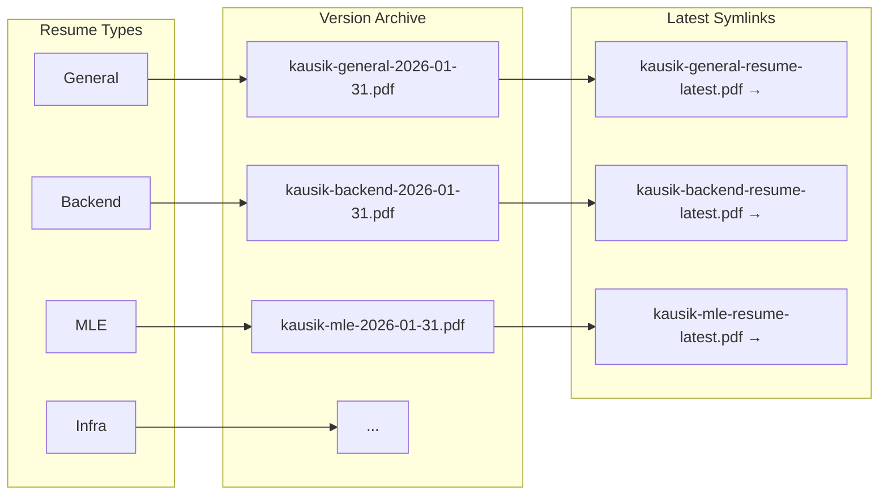

# Resume

Here is my resume tailored for each job type based on the work I did as I could not fit all of them in one page. 

**Download Latest Resumes:**
- [General](https://github.com/Kausik-A/Resume/raw/main/General/general-resume-rendered-archive/kausik-general-2026-01-31.pdf)
- [Backend](https://github.com/Kausik-A/Resume/raw/main/Backend/backend-resume-rendered-archive/kausik-backend-2026-01-31.pdf)
- [MLE](https://github.com/Kausik-A/Resume/raw/main/MLE/mle-resume-rendered-archive/kausik-mle-2026-01-31.pdf)
- [Infra](https://github.com/Kausik-A/Resume/raw/main/Infra/infra-resume-rendered-archive/kausik-infra-2026-01-31.pdf)

# Intro

My professional resume built with LaTeX. Organized by job type for easy version trackinga as it was getting tricky to keep track of files named `resume-latest.pdf`, `resume-latest-final.pdf`, `resume-latest-final-FOREAL.pdf`... you get it 💀

## Why hyper optimize?

~~**productive procrastination**~~

I needed a proper version control system for managing different resume versions tailored to specific job roles (Backend, MLE, Infra, etc.) while keeping the build process fast and organized. 

Git tracks every change with a clear history tree, so I can see how my resume evolved over time and easily revert if needed. And yes—trying to ~~hyper-optimize for ATS/AI parsing~~ get recruiters' attention :)

## Structure

Resumes are organized into job-specific folders:

- `General/` - General-purpose resume
- `Backend/` - Backend engineering focus
- `MLE/` - Machine Learning Engineer focus  
- `Infra/` - Infrastructure/DevOps focus
- `Experiment/` - YOLO algo prompt hacking (ONLY FOR RESEARCH PURPOSES)

Each folder contains:
- `main.tex` - Resume content
- `resume.cls` - LaTeX styling
- `<folder>-resume-rendered-archive/` - Date-stamped versions
- `kausik-<folder>-resume-latest.pdf` - Symlink to latest version

## Build

I custom wrote the build script for [MiKTeX](https://miktex.org/) as I use that on Mac. Any distribution should work with tweaks to `build.sh`

My good friend [kimi](https://huggingface.co/moonshotai/Kimi-K2.5) drew me this mermaid diagram to explain this clearly.



### Build Commands

```bash
# Build all folders
make

# Build specific folder
make General      
make Backend      
make MLE          
make Infra
